<p align="center">
  
</p>

<p align="center">
  <strong>The open-source, local-first companion and combat analytics engine for Magic: The Gathering Arena on Linux, macOS & Windows.</strong>
</p>

<p align="center">
  <a href="https://github.com/Balthazzahr/Rhystic-Tracker/releases"></a>
  
  
  
  
</p>

<p align="center">
  <a href="docs/USER_GUIDE.md"><strong>📖 User Guide & Manual</strong></a> &nbsp;•&nbsp;
  <a href="docs/CHANGELOG.md"><strong>📝 Release Changelog</strong></a> &nbsp;•&nbsp;
  <a href="https://github.com/Balthazzahr/Rhystic-Tracker/releases"><strong>📦 GitHub Releases</strong></a>
</p>

---

## ⚡ What is Rhystic Tracker?

**Rhystic Tracker** is a native, ultra-responsive desktop companion for MTG Arena on Linux, macOS, and Windows. It continuously parses MTGA's `Player.log` in real time, persisting every match, mulligan, card draw, spell resolution, token creation, permanent destruction, and combat damage swing into a local SQLite database on your machine.

Built with **Tauri v2**, **Rust**, **React 18**, and **TypeScript**, it delivers maximum visual performance and instant zero-latency queries without cloud requirements, tracking accounts, or telemetry.

> **Fan Content Disclaimer:** Rhystic Tracker is unofficial Fan Content permitted under the Wizards of the Coast Fan Content Policy. Portions of the materials used are property of Wizards of the Coast. © Wizards of the Coast LLC. Card artwork and symbols are fetched via Scryfall's API.

---

## ✨ Features at a Glance

- 🎨 **Authentic MTG Visual Aesthetic**: Complete sharp geometry (`rounded-none`), official **Beleren Bold** & **Plantin MTG** typography, and authentic MTG mana and ability font iconography.
- 🔍 **Advanced Match Filtering & Dedicated Commander Columns**: Filter matches by multiple commanders (OR) and multiple cards in deck (AND) with fuzzy type-ahead autocomplete, plus dedicated table columns for hero and opponent commanders with square art crops.
- ⚙️ **Categorized Tabbed Settings**: Organized into 5 dedicated tabs (*General & Behavior*, *Appearance & Themes*, *MTGA Connection*, *Storage & Database*, *About & Legal*) with safety confirmations and card density controls.
- 🔍 **Expanded Floating Inspector Workspaces**: Massive `95vw × 97vh` modal workspaces for Decks, Matches, and Cards with borderless floating analytics, authentic mana pie charts, and turn-by-turn combat replay.
- 🔄 **Automatic True Decklist Capture & UUID Sync**: Automatic ingestion of 100% full genuine decklists (including Commanders) upon starting a match or navigating decks, paired with MTGA persistent UUID tracking that automatically propagates deck modifications and renames while preserving historical match analytics.
- 🏆 **Global Card Achievements & Trophy Case**: 21 custom SVG achievement emblems spanning 7 categories with Bronze, Silver, and Gold tiers, objective value thresholds ($X+$), MVP showcase, center-out symmetrical square clustering, and interactive drill-down roster modal with MTG lore quotes.
- 🏛️ **All-Time Leaderboards & Hall of Fame**: 3×3 domain grid across Combat Damage, Non-Combat Damage, and Honors & Mastery with 9 categories (including Card Draw Engines and Battlefield Stalwarts), podium styling with crowns, full-height 25-card drill-down modal, live search, and diff-to-podium tracking.
- 🍏 **Cross-Platform Linux, macOS & Windows Support**: Universal release packaging with native log and raw card database discovery across Linux (Proton, Lutris, Bottles, Heroic), macOS, and Windows.
- 🃏 **Mulligan Tracking & Timeline Replay**: Full London mulligan detection, opening hand buffer state machine, and dedicated Opening Phase section in the Match Play Timeline with amber `mulligan` and orange `bottom` badges.
- 🧙‍♂️ **First-Time Setup Wizard & Dynamic Discovery**: Guided 3-step setup with real-time log detection across all prefixes, plus instant startup card indexing (26,000+ cards in ~150ms).
- 🏅 **Comprehensive MTGA Formats Coverage**: Native categorization and distinct colored badges for all 13 formats (Standard, Standard Brawl, Brawl, Alchemy, Historic, Timeless, Explorer, Draft, Sealed, Bot Match with precon resolution, Direct Challenge, Midweek Magic, and Gladiator).
- 📊 **Dashboard & Time-Series Win Rate Analytics**: Today's and all-time records, active streak counter, daily match grouping, overhauled 3x2 format breakdown, and time-series graph with 5 time windows (`Today`, `7 Days`, `30 Days`, `12 Months`, `All Time`), dual-colored 50% threshold trend line (green/red), and volume histograms.
- ⚔️ **Live Match HUD**: Real-time game state tracker showing hero/opponent commanders, life swings, card plays, token creations, death/exile logs, and detailed combat/spell damage attributions with authentic MTG font icons.
- 📈 **Lifetime Card Combat Analytics**: Persistent per-card metrics — win rate when cast, total damage dealt (face vs permanent splits), combat vs spell classification, MVP decks, and turn cast frequency histograms.
- 🎴 **Deck Library & 3-Column Inspector**: Automatic and manual True-decklist management, starter deck exclusions, responsive 3-column decklist expansion for widescreen displays, enlarged mana distribution pie chart, and centered `MANA VALUE` histogram pill overlay.
- 🖼️ **Card Library & Real-Time Collection Sync**: Visual collection explorer synced with submitted decks, calibrated 4×3 full-card grid, 4-diamond interactive ownership controls, and persistent alternate set printing selection.
- 🎨 **Five Color-Identity Mana Themes**: Dynamic White, Blue, Black, Red, and Green themes that meticulously tint the entire application.

---

## 📸 Screenshots Showcase

|                  Dashboard (Bento Grid)                   |                  Match History                   |
| :-------------------------------------------------------: | :----------------------------------------------: |
|        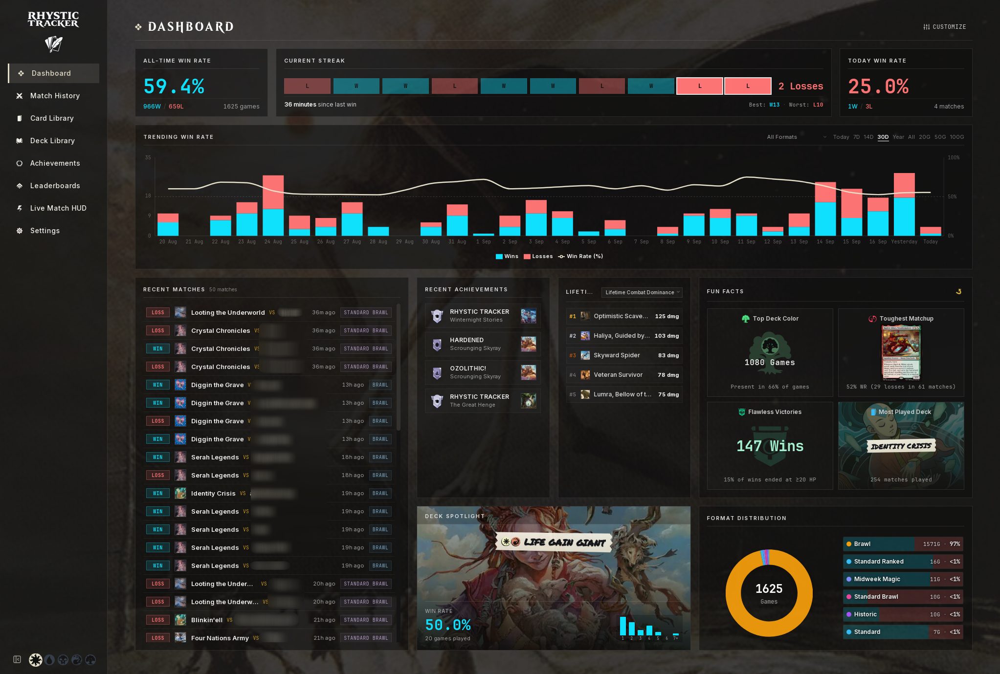        |   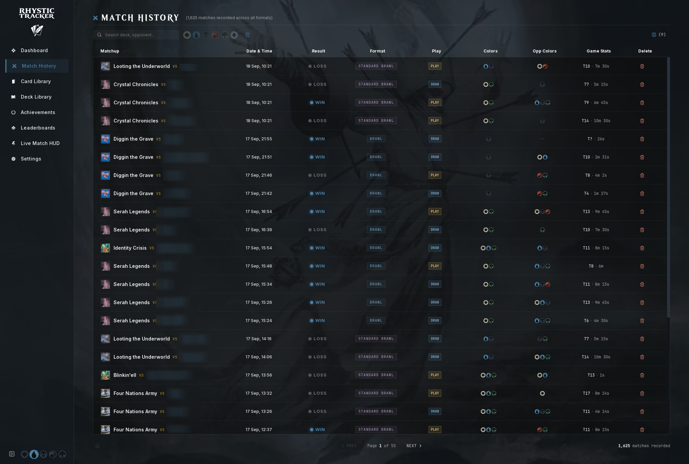    |

|             Match Inspector (Timeline Replay)             |                  Live Match HUD                  |
| :-------------------------------------------------------: | :----------------------------------------------: |
| 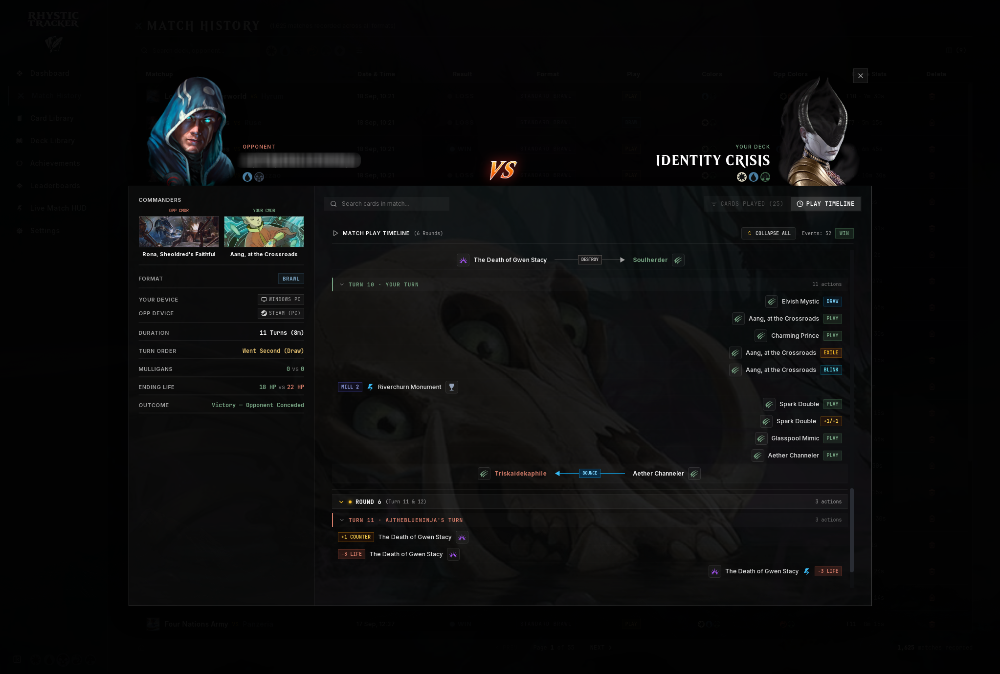 |   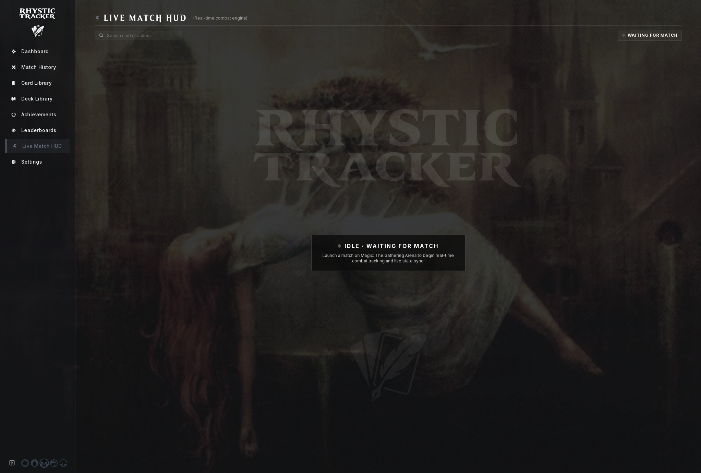   |

|                 Deck Library (Card View)                  |            Deck Library (Table View)             |
| :-------------------------------------------------------: | :----------------------------------------------: |
|   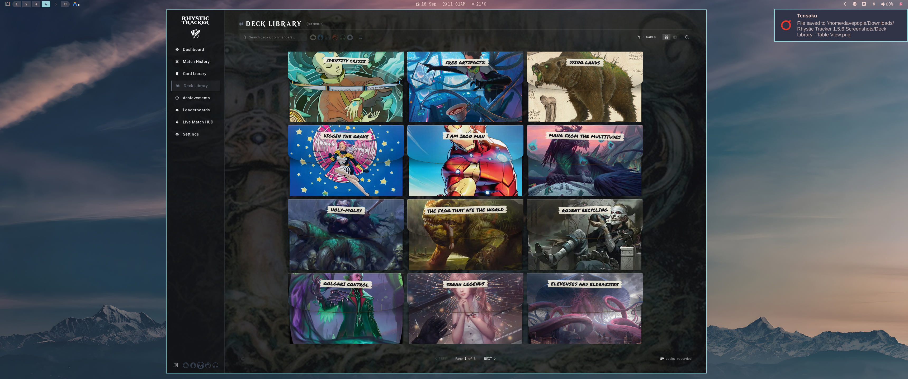    | 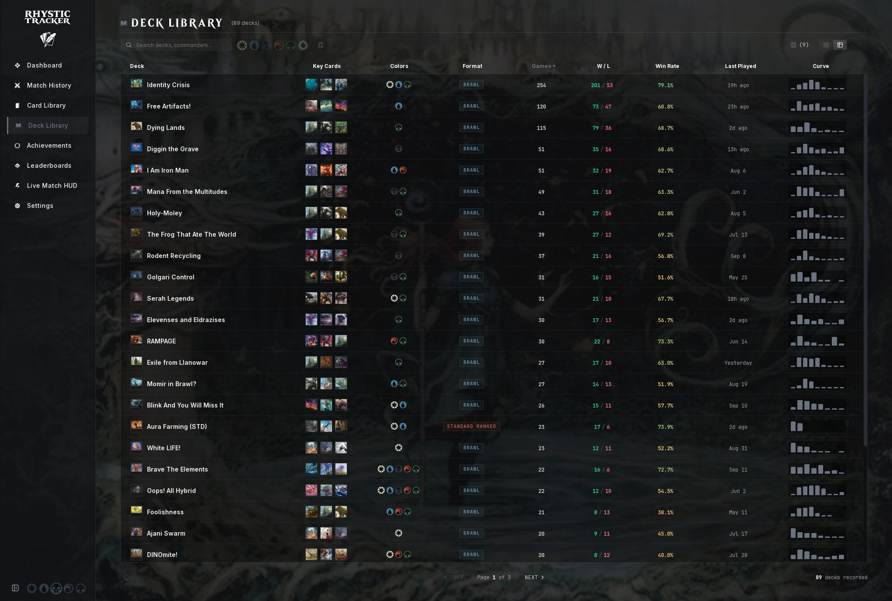 |

|                 Card Library (Card View)                  |            Card Library (Table View)             |
| :-------------------------------------------------------: | :----------------------------------------------: |
|   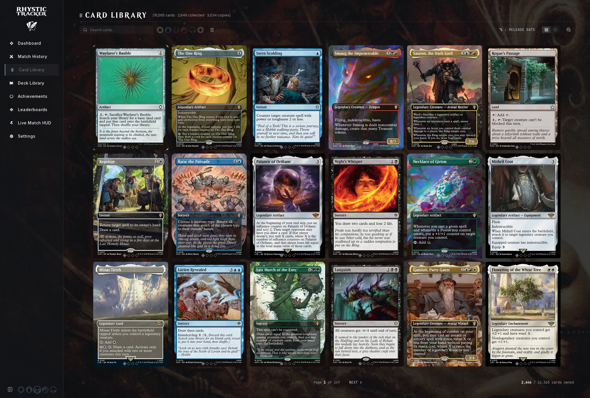    | 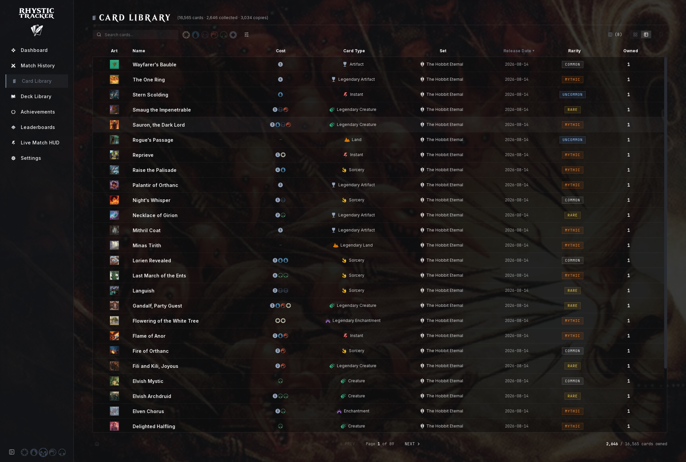 |

|                  3-Panel Card Inspector                   |            Global Achievements & Trophies        |
| :-------------------------------------------------------: | :----------------------------------------------: |
| 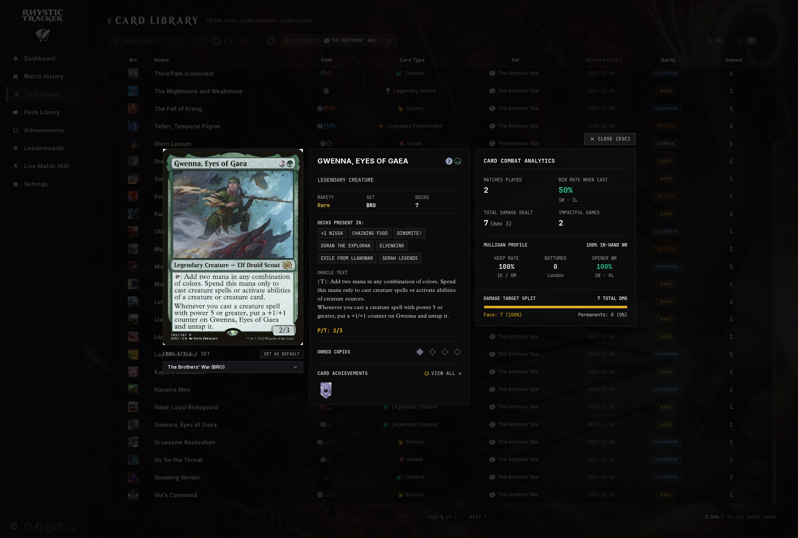 |     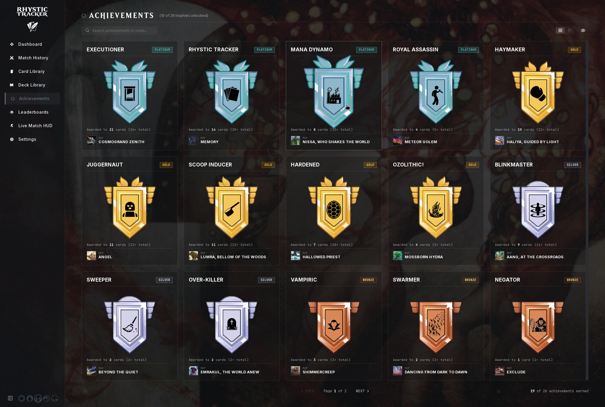     |

|                 Achievement Details Roster                |            All-Time Leaderboards & Podium        |
| :-------------------------------------------------------: | :----------------------------------------------: |
| 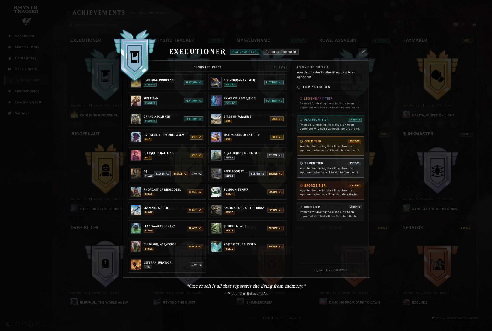 |     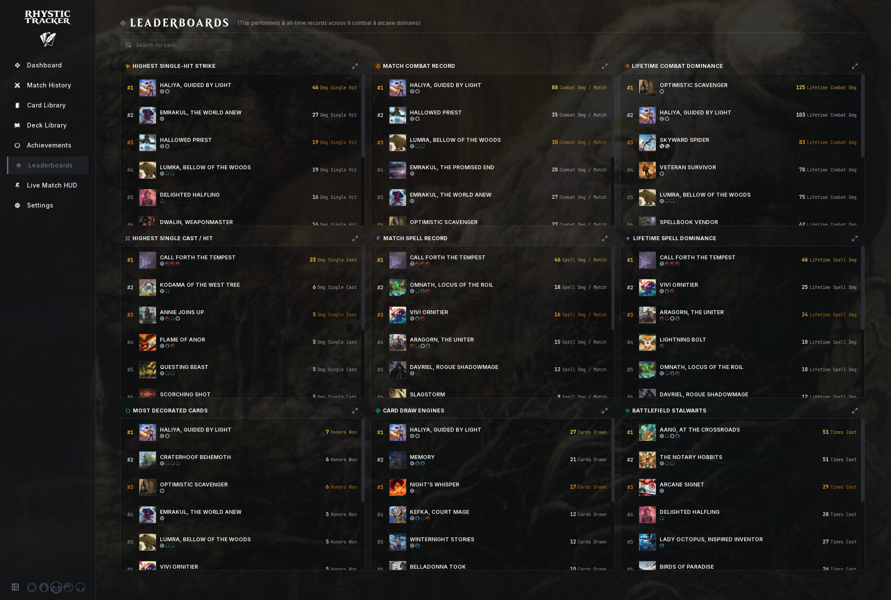     |

|                 Leaderboard 25-Card Drilldown             |
| :-------------------------------------------------------: |
| 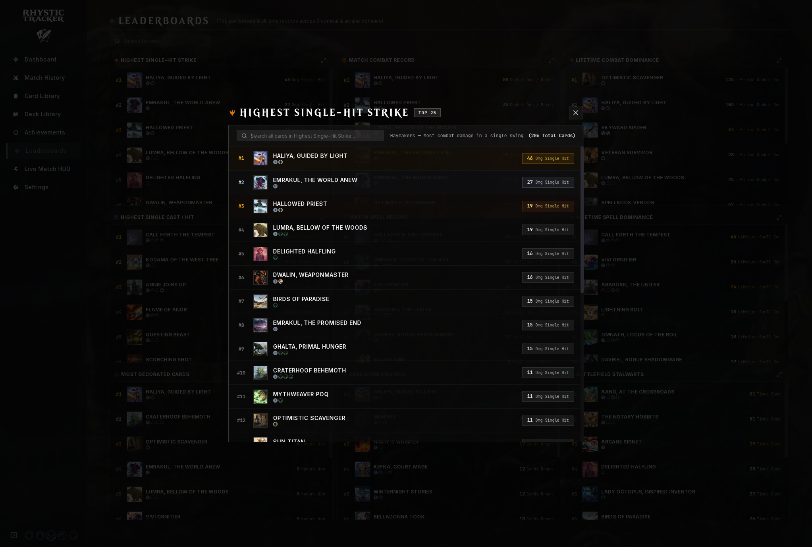 |

---

## 🚀 Quick Start & Installation

### Option 1: One-Line Installer (Recommended)

Run the automated installer in your terminal. It automatically fetches the latest release, installs the binary, registers the application icon, and sets up your desktop launcher:

```bash
curl -sSL https://raw.githubusercontent.com/Balthazzahr/Rhystic-Tracker/main/install.sh | bash
```

_(Alternatively using `wget`: `wget -qO- https://raw.githubusercontent.com/Balthazzahr/Rhystic-Tracker/main/install.sh | bash`)_

The installer copies the binary to `~/.local/bin/rhystic-tracker`, registers high-resolution application icons into `~/.local/share/icons/`, and creates the desktop entry so Rhystic Tracker appears immediately in your application launcher (**GNOME**, **Pop Launcher**, **Cosmic**, **Rofi**, **Wofi**, **KDE Plasma**).

> **Note:** `install.sh` automatically sets `GDK_BACKEND=x11` in the desktop launcher so the app works correctly on both X11 and Wayland sessions (via XWayland).

### Option 2: Arch Linux (AUR)

For **Arch Linux**, **Omarchy**, **CachyOS**, **Manjaro**, and **EndeavourOS** users:

```bash
# Install pre-compiled binary package
yay -S rhystic-tracker-bin
# or build latest from git master
yay -S rhystic-tracker-git
```

*(Or build manually using `makepkg -si` inside `packaging/aur/rhystic-tracker-bin/`)*

### Option 3: Manual Download from GitHub Releases

- **Linux (`x86_64`)**:
  1. Download `rhystic-tracker-linux-x86_64.tar.gz` from [GitHub Releases](https://github.com/Balthazzahr/Rhystic-Tracker/releases/latest).
  2. Extract and run `./install.sh`:
     ```bash
     tar -xzf rhystic-tracker-linux-x86_64.tar.gz
     ./install.sh
     ```

- **macOS (Universal - Apple Silicon & Intel)**:
  1. Download `rhystic-tracker-macos-universal.dmg` from [GitHub Releases](https://github.com/Balthazzahr/Rhystic-Tracker/releases/latest).
  2. Open the `.dmg` and drag **Rhystic Tracker** to your **Applications** folder.
  3. *First launch Gatekeeper bypass*: Right-click (or Control-click) **Rhystic Tracker** in Applications, select **Open**, and confirm **Open**.

- **Windows (`x86_64`)** — *(Community Verified / CI Built)*:
  1. Download `rhystic-tracker-windows-setup.exe` (or `rhystic-tracker-windows-x86_64.zip`) from [GitHub Releases](https://github.com/Balthazzahr/Rhystic-Tracker/releases/latest).
  2. Run the setup installer (or extract the `.zip` archive) and launch `rhystic-tracker.exe`.
  > **⚠️ Windows Community Release Note**: Windows binaries are built automatically via GitHub Actions CI from our cross-platform codebase. Since primary development and testing takes place on Linux, Windows releases have not undergone direct local QA. If you discover any bugs or path issues on Windows, please report them on [GitHub Issues](https://github.com/Balthazzahr/Rhystic-Tracker/issues)!

---

### Option 4: Build from Source

If you prefer to compile from source or clone the repository:

#### 1. Install System Dependencies

Rhystic Tracker uses Tauri v2, which requires WebKitGTK and standard GTK3 build libraries on Linux.

**Debian / Ubuntu / Pop!\_OS / Linux Mint:**

```bash
sudo apt update
sudo apt install -y libwebkit2gtk-4.1-dev libgtk-3-dev libayatana-appindicator3-dev librsvg2-dev build-essential curl wget file libssl-dev libjavascriptcoregtk-4.1-dev nodejs npm
```

**Arch Linux / Omarchy / Manjaro:**

```bash
sudo pacman -S --needed webkit2gtk-4.1 base-devel curl wget openssl appmenu-gtk-module libappindicator-gtk3 librsvg nodejs npm
```

**Fedora / RHEL:**

```bash
sudo dnf install -y webkit2gtk4.1-devel gtk3-devel libappindicator-gtk3-devel librsvg2-devel openssl-devel @development-tools nodejs npm
```

**macOS:**

```bash
xcode-select --install
```

#### 2. Install Node.js & Rust (if not already installed)

- [Node.js](https://nodejs.org/) (v18+)
- [Rust](https://www.rust-lang.org/tools/install): `curl --proto '=https' --tlsv1.2 -sSf https://sh.rustup.rs | sh`

#### 3. Clone, Build, and Install

```bash
# Clone the repository
git clone https://github.com/Balthazzahr/Rhystic-Tracker.git
cd Rhystic-Tracker

# Install dependencies and build self-contained release app
npm install
npm run build:app

# Run installer to place binary and desktop shortcuts
./install.sh
```

---

### 📦 Runtime Dependencies (For Pre-built Binaries)

If running the pre-built release binary on a minimal or newly installed Linux system, ensure the WebKitGTK 4.1 runtime is present:

- **Pop!\_OS / Ubuntu / Debian:** `sudo apt install libwebkit2gtk-4.1-0 libayatana-appindicator3-1`
- **Arch Linux:** `sudo pacman -S webkit2gtk-4.1 libappindicator-gtk3`
- **Fedora:** `sudo dnf install webkit2gtk4.1 libappindicator-gtk3`

---

### 🖥️ Wayland / Steam Deck Note

Rhystic Tracker requires **X11** or **XWayland**. The desktop launcher installed by `install.sh` automatically sets `GDK_BACKEND=x11`, so it works on both X11 and Wayland sessions out of the box. If you launch the binary directly from a terminal on a Wayland-only session, prepend the env var:

```bash
GDK_BACKEND=x11 rhystic-tracker
```

---

### 🗑️ Uninstall

```bash
rm ~/.local/bin/rhystic-tracker \
   ~/.local/share/applications/rhystic-tracker.desktop \
   ~/.local/share/icons/hicolor/512x512/apps/rhystic-tracker.png
```

Your match data in `~/.config/rhystic-tracker/rhystic.db` is preserved and can be backed up or deleted separately.

---

## 📄 License

This project is licensed under the [MIT License](LICENSE).
