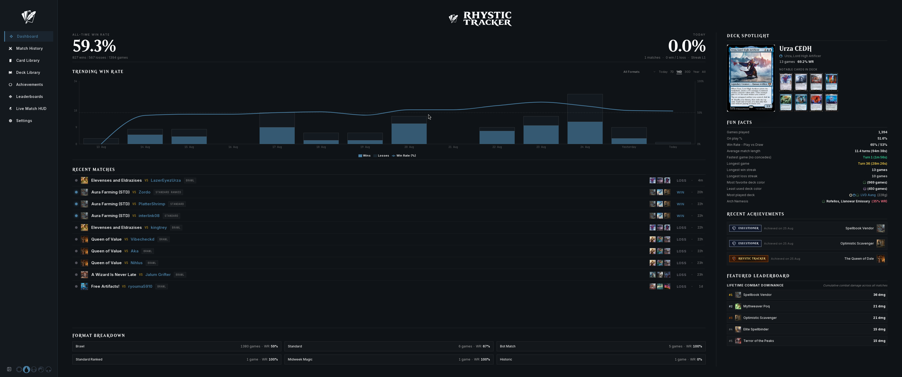
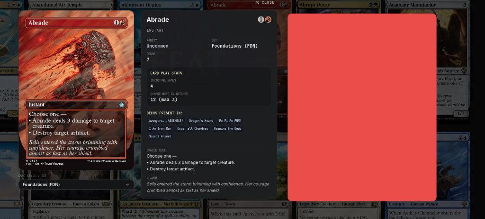
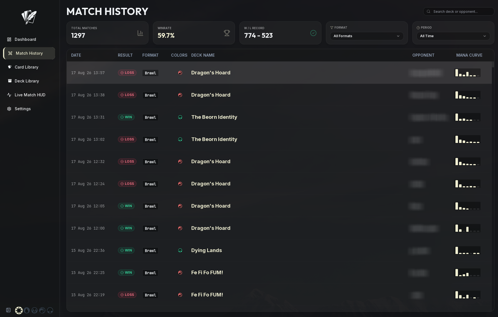
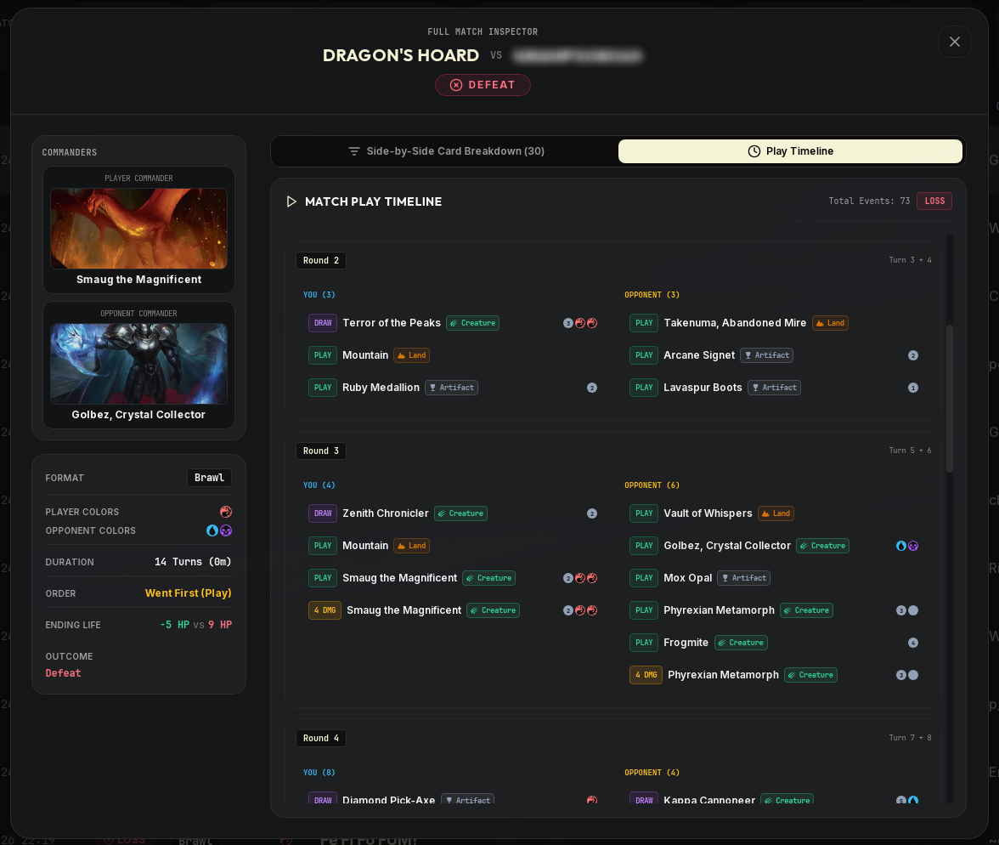
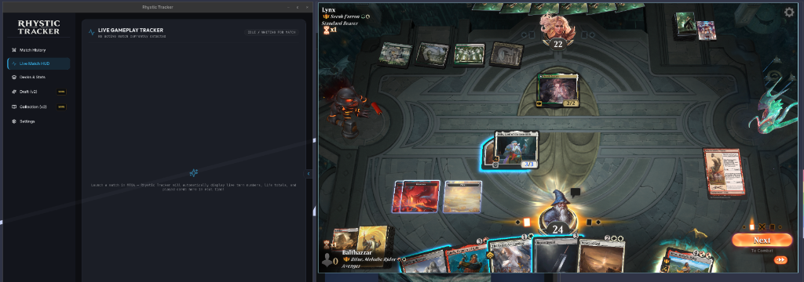
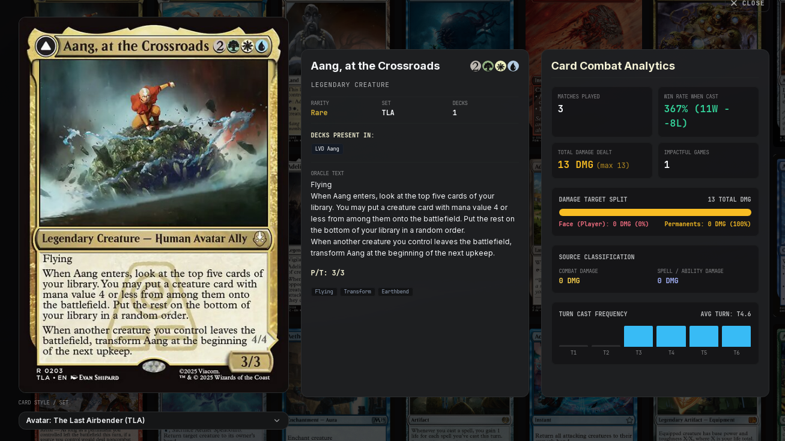

<p align="center">
  
</p>

<p align="center">
  <strong>The open-source, local-first companion and combat analytics engine for Magic: The Gathering Arena on Linux.</strong>
</p>

<p align="center">
  
  
  
  
  
</p>

---

## ⚡ What is Rhystic Tracker?

**Rhystic Tracker** is a native, ultra-responsive desktop companion for MTG Arena on Linux. It continuously parses MTGA's `Player.log` in real time, persisting every match, mulligan, card draw, spell resolution, token creation, permanent destruction, and combat damage swing into a local SQLite database on your machine.

Built with **Tauri v2**, **Rust**, **React 18**, and **TypeScript**, it delivers maximum visual performance and instant zero-latency queries without cloud requirements, tracking accounts, or telemetry.

> **Fan Content Disclaimer:** Rhystic Tracker is unofficial Fan Content permitted under the Wizards of the Coast Fan Content Policy. Portions of the materials used are property of Wizards of the Coast. © Wizards of the Coast LLC. Card artwork and symbols are fetched via Scryfall's API.

---

## ✨ Features at a Glance

- 📊 **Executive Dashboard**: Today's and all-time record, win rate trends, current streak counter, daily match grouping, and rotating deck spotlights.
- ⚔️ **Live Match HUD**: Real-time game state tracker showing hero and opponent life changes, card plays, token creations, death/exile logs, and detailed combat/spell damage attributions with MTG font icons.
- 🔍 **Full Match Inspector & Turn Timeline**: Granular play-by-play combat replay per turn, highlighting damage magnitude (`[4 DMG]`), card types, life swings, and victory/defeat causes.
- 📈 **Lifetime Card Combat Analytics**: Persistent per-card metrics — win rate when cast, total damage dealt (face vs permanent splits), combat vs spell classification, MVP decks, and turn cast frequency histograms.
- 🃏 **Deck & Card Library**: Visual collection explorer, full true-decklist import/export (`.txt` / MTGA format), deck legitimacy verification (protects stats from preset/starter decks), and 450px high-resolution card artwork viewers with Scryfall oracle texts.
- 🎨 **Five Color-Identity Mana Themes**: Dynamic White, Blue, Black, Red, and Green themes that meticulously tint the entire application.

---

## 📸 Screenshots Showcase

| Executive Dashboard | Live Match HUD |
| :---: | :---: |
|  |  |

| Match History & Match Inspector | Turn Playback & Combat Timeline |
| :---: | :---: |
|  |  |

| Deck Library & True Decklist Inspector | Card Library & Combat Analytics |
| :---: | :---: |
|  |  |

---

## 🚀 Quick Start & Installation

### Option 1: 1-Command Installer (Arch Linux, Omarchy, Ubuntu, Fedora, Debian)

Clone the repository and run the automated installer:

```bash
git clone https://github.com/Balthazzahr/Rhystic-Tracker.git
cd Rhystic-Tracker
./install.sh
```

`install.sh` automatically compiles/installs the release binary to `~/.local/bin/rhystic-tracker`, places high-resolution application icons into `~/.local/share/icons/`, and registers the desktop entry so Rhystic Tracker appears immediately in your application launcher (**Rofi**, **Wofi**, **Krunner**, **GNOME**, **KDE Plasma**).

---

### Option 2: Standalone AppImage

Download the latest `Rhystic-Tracker-1.0.0.AppImage` from the [GitHub Releases](https://github.com/Balthazzahr/Rhystic-Tracker/releases) page:

```bash
chmod +x Rhystic-Tracker-1.0.0.AppImage
./Rhystic-Tracker-1.0.0.AppImage
```

---

## ⚙️ MTG Arena Setup Requirement

For MTG Arena to output detailed match and combat records, you must enable plugin logging once inside the game:

1. Open **MTG Arena**.
2. Click the **Gear Icon (Settings)** in the top right $\rightarrow$ Select **Account**.
3. Check the box for **"Detailed Logs (Plugin Support)"**.
4. Restart MTG Arena.

---

## 📖 Documentation

For full setup guides across Steam Proton, Lutris, Bottles, Heroic, environment variable overrides (`RHYSTIC_MTGA_LOG`), card library features, and troubleshooting, please read our:

👉 **[Complete User Manual & Troubleshooting Guide (USER_GUIDE.md)](USER_GUIDE.md)**

---

## 🛠️ Building from Source

### Prerequisites
- [Node.js](https://nodejs.org/) (v18+)
- [Rust](https://www.rust-lang.org/tools/install) toolchain
- System WebKitGTK dependencies (`webkit2gtk-4.1` on Arch / Debian / Fedora)

```bash
# 1. Install frontend dependencies
npm install

# 2. Build the production frontend
npm run build

# 3. Build release binary
cd src-tauri
cargo build --release
```

---

## 📄 License

This project is licensed under the [MIT License](LICENSE).
