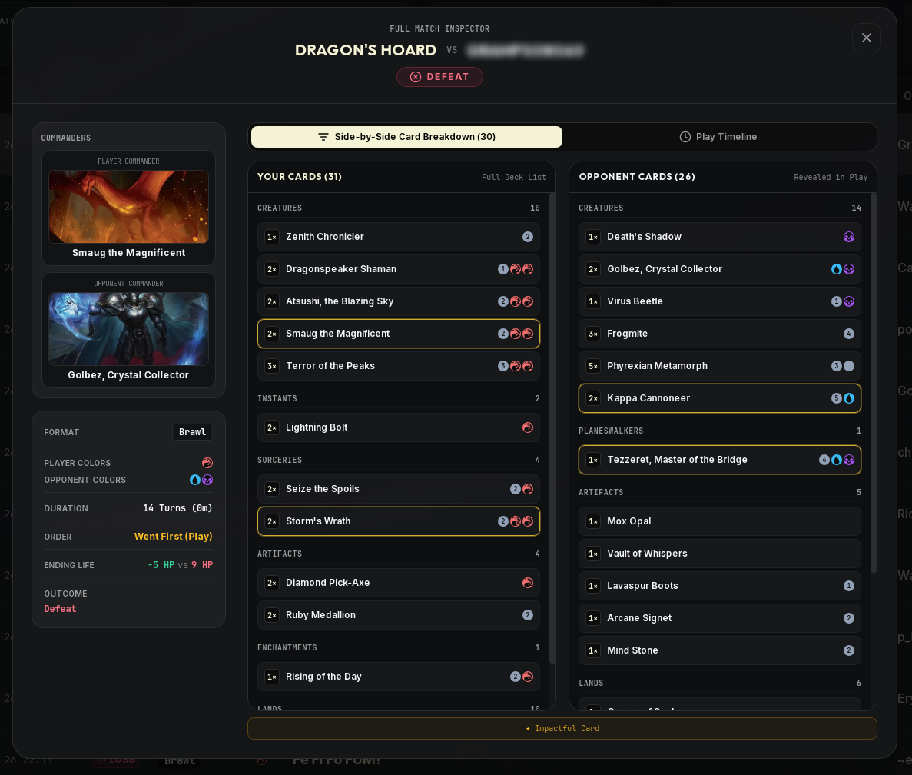
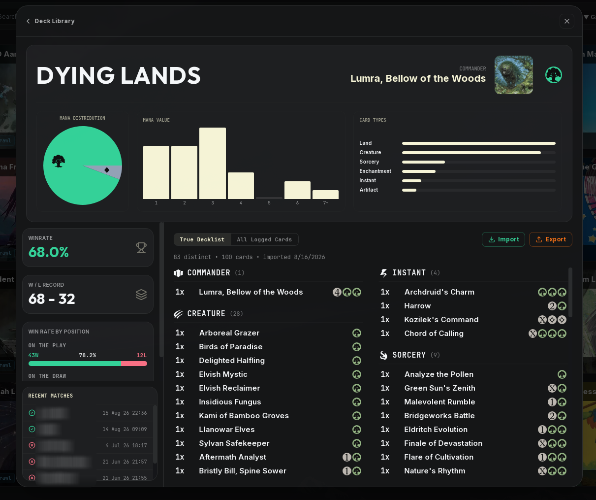
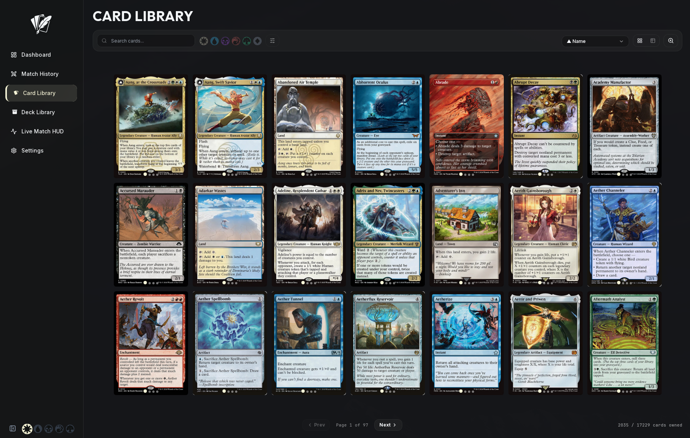

# Rhystic Tracker — Official User Manual & Setup Guide

Welcome to the comprehensive user manual and setup guide for **Rhystic Tracker v1.1.4**. This document explains how Rhystic Tracker operates under the hood, how to configure your Linux environment, how to use every feature and analytical tool, and how to troubleshoot common questions.

---

## Table of Contents

1. [How Rhystic Tracker Works](#1-how-rhystic-tracker-works)
2. [MTG Arena Game Configuration](#2-mtg-arena-game-configuration)
3. [Linux Setup & Dynamic Log Discovery](#3-linux-setup--dynamic-log-discovery)
   - [Steam Proton (Native & Mounted Libraries)](#steam-proton-native--mounted-libraries)
   - [Lutris, Bottles, and Heroic Games Launcher](#lutris-bottles-and-heroic-games-launcher)
   - [Manual Path & Environment Overrides](#manual-path--environment-overrides)
4. [First-Time Setup Wizard & Card DB Sync](#4-first-time-setup-wizard--card-db-sync)
   - [The 3-Step Onboarding Wizard](#the-3-step-onboarding-wizard)
   - [High-Speed Startup Card Database Sync](#high-speed-startup-card-database-sync)
   - [Re-Running Setup Wizard & Manual Re-Syncing](#re-running-setup-wizard--manual-re-syncing)
5. [Desktop Integration & Dual Environments](#5-desktop-integration--dual-environments)
   - [Automated Web & Local Installer (`install.sh`)](#automated-web--local-installer-installsh)
   - [Wayland, XWayland, and Steam Deck Guidelines](#wayland-xwayland-and-steam-deck-guidelines)
   - [Dual-Environment Architecture (Test vs. Production)](#dual-environment-architecture-test-vs-production)
6. [Feature Guide](#6-feature-guide)
   - [Dashboard & Time-Series Win Rate Analytics](#dashboard--time-series-win-rate-analytics)
   - [Comprehensive MTGA Formats Coverage](#comprehensive-mtga-formats-coverage)
   - [Live Match HUD & Real-Time Combat Feed](#live-match-hud--real-time-combat-feed)
   - [Match History & Full Match Inspector](#match-history--full-match-inspector)
   - [Deck Library, 3-Column Inspector & True Decklists](#deck-library-3-column-inspector--true-decklists)
   - [Card Library, Dual Art Modes & Diamond Ownership](#card-library-dual-art-modes--diamond-ownership)
   - [Settings & Configuration Control Panel](#settings--configuration-control-panel)
   - [Theming Engine](#theming-engine)
7. [Data Storage & Privacy](#7-data-storage--privacy)
8. [Frequently Asked Questions (FAQ)](#8-frequently-asked-questions-faq)

---

## 1. How Rhystic Tracker Works

Rhystic Tracker is an **out-of-process, non-intrusive, read-only** log parser and combat analytics engine. It does not inject into MTG Arena memory, alter game binaries, or intercept network packets.

```
┌─────────────────┐
│ MTGA Player.log │
└────────┬────────┘
         │ (1) Asynchronous append monitoring (inotify / polling)
         ▼
┌─────────────────┐
│   FileTailer    │ Reads new bytes, buffers lines, tracks file rotations
└────────┬────────┘
         │ (2) mpsc::channel<TailerEvent::Line>
         ▼
┌─────────────────┐
│     Parser      │ Extracts GRE engine messages, life totals, zone transfers,
│                 │ damage events, and deck submissions (EventSetDeckV3)
└────────┬────────┘
         │ (3) ParsedEvent stream
         ▼
┌─────────────────┐
│ MatchAssembler  │ State machine attributing combat damage, hero/opponent seats,
│                 │ turn progression, and deck legitimacy
└────────┬────────┘
         │ (4) Match records & turn events
         ▼
┌─────────────────┐
│ SQLite Database │ Fast local queries in `~/.config/rhystic-tracker/rhystic.db`
└────────┬────────┘
         │ (5) Tauri v2 IPC commands & live state subscriptions
         ▼
┌─────────────────┐
│ React Frontend  │ Real-time HUD, interactive charts, virtualized card grids
└─────────────────┘
```

When MTG Arena runs with detailed logging enabled, it writes game rule engine (GRE) messages (zone transfers, game state changes, life swings, damage annotations) into `Player.log`. Rhystic Tracker's asynchronous Rust backend monitors this file, parses the events, attributes damages and card ownership, and commits the records into a local SQLite database (`~/.config/rhystic-tracker/rhystic.db`).

---

## 2. MTG Arena Game Configuration

For MTG Arena to output complete match records and combat details, detailed logs must be enabled in the game client:

1. Launch **Magic: The Gathering Arena**.
2. Click the **Gear Icon** in the top-right corner to open **Options**.
3. Under the **Account** tab (bottom left of the settings screen), locate **"Detailed Logs (Plugin Support)"**.
4. Check the box to enable it.
5. **Restart MTG Arena**.

> 💡 **Note:** If detailed logging is disabled, `Player.log` will only output basic startup information and will omit combat actions, card plays, and turn state transitions.

---

## 3. Linux Setup & Dynamic Log Discovery

Rhystic Tracker features an intelligent auto-discovery engine that dynamically locates both `Player.log` and the MTGA Raw Card Database without requiring hardcoded paths.

### Steam Proton (Native & Mounted Libraries)
If you run MTGA via Steam on Linux or Steam Deck:
- Rhystic Tracker automatically inspects:
  - `~/.local/share/Steam/steamapps/compatdata/2141910/pfx/drive_c/users/.../AppData/LocalLow/Wizards Of The Coast/MTGA/Player.log`
  - `~/.steam/steam/steamapps/compatdata/2141910/...`
  - Any external mounted Steam library folders across all mount roots (e.g. `/mnt/*/SteamLibrary/steamapps/compatdata/...`, `/teradrive/...`, `/media/...`, `/run/media/*/*`).

### Lutris, Bottles, and Heroic Games Launcher
If you run MTGA through standalone Wine, Lutris, or Bottles:
- Common Lutris paths (`~/Games/mtga`, `~/Games/magic-the-gathering-arena`) and Bottles prefixes are scanned automatically.
- The raw card database path is dynamically inferred by walking up from the discovered `Player.log` directory to locate `Program Files/Wizards of the Coast/MTGA/MTGA_Data/Downloads/Raw/`.

### Manual Path & Environment Overrides
If your setup uses an unconventional path, you can set the `RHYSTIC_MTGA_LOG` environment variable:

```bash
RHYSTIC_MTGA_LOG="/path/to/your/prefix/drive_c/users/youruser/AppData/LocalLow/Wizards Of The Coast/MTGA/Player.log" rhystic-tracker
```

You can also point Rhystic Tracker to a custom raw card database cache if needed:
```bash
RHYSTIC_MTGA_RAW_DIR="/path/to/Raw/Card/Database" rhystic-tracker
```

---

## 4. First-Time Setup Wizard & Card DB Sync

### The 3-Step Onboarding Wizard
On fresh installations (or when the internal card database is unpopulated), Rhystic Tracker launches a 3-step setup wizard:

1. **Step 1 — Log File Discovery**: Automatically scans all Proton, Wine, Lutris, and Bottles prefixes, displaying the detected `Player.log` path with real-time validation and a reminder to enable MTGA Detailed Logging.
2. **Step 2 — Card Database Sync**: Scans MTGA's Raw Card Database and synchronizes all 26,000+ cards into the local SQLite cache (~150ms) with an animated progress indicator.
3. **Step 3 — Ready for Combat**: Confirms operational readiness and transitions seamlessly into the Dashboard.

### High-Speed Startup Card Database Sync
Whenever Rhystic Tracker starts, a background task automatically checks if `cards_cache` is populated. If empty or updated, all ~26,000+ cards are indexed in roughly ~150ms without blocking UI interaction or delaying app launch.

### Re-Running Setup Wizard & Manual Re-Syncing
You can re-verify your system configuration anytime from the **Settings** view:
- **Card Database Status**: Displays the exact indexed card count (e.g. `26,572 cards ready`).
- **Re-sync Cards Button**: 1-click manual re-indexing to ingest new MTGA card sets immediately after client updates.
- **Re-run Setup Wizard…**: Opens the onboarding wizard with an interactive safety confirmation modal (your match history and collection remain untouched).

---

## 5. Desktop Integration & Dual Environments

### Automated Web & Local Installer (`install.sh`)

#### Option A: One-Line Web Installer (Recommended)
```bash
curl -sSL https://raw.githubusercontent.com/Balthazzahr/Rhystic-Tracker/main/install.sh | bash
```
*(Or with `wget`: `wget -qO- https://raw.githubusercontent.com/Balthazzahr/Rhystic-Tracker/main/install.sh | bash`)*

#### Option B: Manual Release Archive
1. Download `rhystic-tracker-*.tar.gz` from [GitHub Releases](https://github.com/Balthazzahr/Rhystic-Tracker/releases/latest).
2. Extract the archive and execute `./install.sh`:
   ```bash
   tar -xzf rhystic-tracker-*.tar.gz
   cd rhystic-tracker-*/
   ./install.sh
   ```

#### What `install.sh` Does:
1. Copies the release binary to `~/.local/bin/rhystic-tracker`.
2. Installs high-resolution app icons into `~/.local/share/icons/hicolor/512x512/apps/rhystic-tracker.png`.
3. Generates the XDG desktop entry in `~/.local/share/applications/rhystic-tracker.desktop` with `GDK_BACKEND=x11` and `WEBKIT_DISABLE_COMPOSITING_MODE=1` flags.
4. Refreshes system desktop and icon databases so Rhystic Tracker appears immediately in your application launcher (**GNOME**, **Pop Launcher**, **COSMIC**, **KDE Plasma**, **Rofi**, **Wofi**).

### Wayland, XWayland, and Steam Deck Guidelines

Rhystic Tracker uses WebKitGTK with hardware-accelerated rendering. The launcher configured by `install.sh` automatically includes `GDK_BACKEND=x11`, which runs smoothly on both native X11 sessions and Wayland sessions (via XWayland).

If launching directly from a terminal in a pure Wayland environment (e.g. Steam Deck Desktop Mode or terminal testing), launch with:
```bash
GDK_BACKEND=x11 rhystic-tracker
```

### Dual-Environment Architecture (Test vs. Production)

To safeguard your daily match history and collection, Rhystic Tracker uses strict environment isolation:

| Environment | Launcher | Database | App Icon | Purpose |
| :--- | :--- | :--- | :--- | :--- |
| **🚀 Production** | `./launch.sh` / Desktop App | `~/.config/rhystic-tracker/rhystic.db` | Standard Quill Logo | Daily driver companion for active MTGA gameplay |
| **🧪 Test / Dev** | `./launch-test.sh` | `~/.config/rhystic-tracker/rhystic_dev.db` | Witch's Hat Badge | Development, bug verification, and layout testing |

> 🛡️ **Auto-Snapshotting**: Whenever `./launch-test.sh` runs, it automatically takes a fresh snapshot of `rhystic.db` $\rightarrow$ `rhystic_dev.db`. You can test new builds against real match data without any risk of corrupting production records.

---

## 6. Feature Guide

### Dashboard & Time-Series Win Rate Analytics
The **Dashboard** serves as your mission control, synthesizing daily performance, active win streaks, multi-window win rate analytics, and match history.

<p align="center">
  
</p>

#### Key Metrics & Streak Tracking
- **Record & Win Rate**: Real-time display of today's match record ($W - L$) and win percentage alongside your all-time career totals.
- **Dynamic Streak Counter**: Highlights active winning or losing streaks with contextual styling.

#### Time-Series Win Rate Graph
The overhauled trend graph combines volume histogram bars with rolling win rate momentum:
- **Time Window Selector**: Dark-themed styled dropdown supporting 5 distinct windows:
  - `Today`: Hourly win/loss distribution.
  - `Past 7 Days`: Daily win/loss volume with 7-day daily rolling win rate.
  - `Past 30 Days`: Daily win/loss volume with 30-day daily rolling win rate.
  - `Past 12 Months`: Week-by-week aggregated volume with 12-month weekly rolling trend.
  - `All Time`: Month-by-month aggregated volume with all-time monthly trend.
- **Dual-Colored 50% Threshold Trend Line**:
  - Displays vibrant green (`#22C55E`) when win rate is above $50\%$.
  - Displays vibrant red (`#EF4444`) when win rate is below $50\%$.
  - Transitions cleanly across the exact $50\%$ midline with a subtle blend.
- **Background Area Wash**: Subtle horizontal time-series shading beneath the curve matching the win status.
- **Outlined Histogram Bars**: Thin white borders around win and loss bars for clear visual separation.
- **Edge-to-Edge Boundaries**: Trend curve and shading span cleanly across the full width of the card.

---

### Comprehensive MTGA Formats Coverage

Rhystic Tracker provides native GRE parser categorization and database normalization across all **13 MTGA formats**:

| Format | Color Badge Accent | Commander Detection |
| :--- | :--- | :--- |
| **Standard** | Vibrant Amber | N/A |
| **Standard Brawl** | Cyan / Teal | Full Hero & Opponent Commander Resolution |
| **Brawl** | Cyan / Teal | Full Hero & Opponent Commander Resolution |
| **Alchemy** | Purple / Violet | N/A |
| **Historic** | Blue / Sapphire | N/A |
| **Timeless** | Emerald Green | N/A |
| **Explorer** | Orange / Copper | N/A |
| **Draft** | Gold / Bronze | N/A |
| **Sealed** | Indigo | N/A |
| **Bot Match (Sparky)** | Slate Grey | Automatic Selected Deck Fingerprint Resolution |
| **Direct Challenge** | Rose / Crimson | N/A |
| **Midweek Magic** | Yellow / Gold | N/A |
| **Gladiator** | Red / Ruby | N/A |

- **Dynamic Format Filter Dropdowns**: Available across the Dashboard and Match History, populating only formats present in your match database.
- **Bot Match Deck Resolution**: Automatically fingerprints Sparky and practice matches against internal deck catalogs to attribute your true deck name (e.g. `'MonoWhite - Auras (Standard)'`) instead of generic labels.

---

### Live Match HUD & Real-Time Combat Feed
While in an active match, click **Live Match HUD** in the left navigation sidebar (the sword icon pulses bright orange when a game is live).

<p align="center">
  
</p>

- **Commander & Color Identity**: Displays both players' commanders (for Brawl variants) and active color identities.
- **Live Action Feed**: Chronological stream of match events:
  - 📥 `[DRAW]`: Cards drawn into hand.
  - 🟢 `[PLAY]`: Spells cast and lands played.
  - 🪙 `[TOKEN]`: Tokens generated on the battlefield (e.g. *Treasure*, *1/1 Goblin*).
  - 💀 `[DIES]`: Permanents destroyed or placed in graveyard.
  - 🌀 `[EXILE]`: Permanents exiled from the battlefield.
  - 💥 `[X DMG]`: Granular combat and spell damage dealt with source and target attributions.
  - ❤️ `[LIFE +/-X]`: Dynamic life total changes.

---

### Match History & Full Match Inspector
Clicking any match in the Dashboard, Match History, Deck detail, or Head-to-Head modal opens the **Full Match Inspector**.

<p align="center">
  
</p>

#### Inspector Ergonomics
- **Dynamic Viewport Scaling**: Modals scale to **80% window width** ($80\text{vw}$) and **90% window height** ($90\text{vh}$) with symmetric buffers.
- **Universal Escape Key & Backdrop Dismissal**: Press <kbd>Esc</kbd> or click the darkened backdrop to immediately dismiss any open modal.

#### Inspector Views
1. **Cards Logged View**: Complete inventory of cards played or seen during the match, partitioned by hero vs opponent with damage contributions.
2. **Match Play Timeline**: Turn-by-turn combat replay showing every draw, play, attack, block, damage event, and removal.

| Cards Logged View | Match Play Timeline |
| :---: | :---: |
|  |  |

---

### Deck Library, 3-Column Inspector & True Decklists
The **Deck Library** tracks performance per deck, format legitimacy, and MTGA-standard decklist import/export.

<p align="center">
  
</p>

- **True Decklists**: Import your exact 60-card or 100-card decklists directly using standard MTGA clipboard format.
- **Legitimacy Verification**: Rhystic Tracker filters out preset and starter decks to prevent skewed collection analytics.
- **Responsive 3-Column Decklist Expansion**:
  - Automatically organizes card types (*Creatures, Instants, Sorceries, Lands, Artifacts, Enchantments, Planeswalkers*) into **3 height-balanced columns** (`colA`, `colB`, `colC`) on wide screens.
  - Eliminates excessive scrolling for 60-card and 100-card Commander lists.
- **Header Analytics**:
  - **Enlarged Mana Distribution Pie Chart**: Distinct colored slices with enlarged mana pips.
  - **Mana Value Curve Histogram**: Full-height histogram with centered translucent floating title badge (`MANA VALUE`).
  - **Card Types Breakdown Bars**: Visual proportional representation of deck makeup.

<p align="center">
  
</p>

---

### Card Library, Dual Art Modes & Diamond Ownership
The **Card Library** provides an interactive visual explorer paired with a 3-panel **Card Inspector** that tracks lifetime combat statistics.

<p align="center">
  
</p>

#### How Collection Ownership Works
Because MTGA no longer dumps complete raw collections into `Player.log`, Rhystic Tracker maintains data integrity through:
1. **True Decklist Import**: Ingests genuine decklists exported from MTGA, registering exact owned counts (1–4).
2. **Theft & Copy Protection**: Cards generated in-game via *tokens, copies, clones (e.g. Spark Double), conjure, heist, or theft effects (e.g. Gonti, Ragavan)* never falsely inflate your owned collection.
3. **Interactive 4-Diamond Ownership Selector**: Adjust owned copies directly in the card detail modal with instant persistence and real-time cross-view synchronization.

#### Dual Art Mode Viewers
Switch between two visual styles in the top toolbar:
- 🖼️ **Landscape Art Crop Mode (`<Image />`)**: Displays uncropped card illustrations in native widescreen aspect ratio with a top semi-transparent title and `<ManaPip />` mana cost bar.
- 🎴 **Portrait Full Card Mode (`<RectangleVertical />`)**: Displays classic complete card frames with oracle rules text.

#### Persistent Alternate Set Printings
When inspecting any card, selecting an alternate set printing from the **Card Style / Set** dropdown immediately updates the main grid with the selected artwork and persists across sessions.

---

### Settings & Configuration Control Panel
The **Settings and Configuration** view is organized in a responsive 2-column control panel:

- **MTGA Log Path Configuration**: Live discovery and validation of `Player.log` with support for Steam Proton, Lutris, Bottles, and custom directory browsers.
- **Desktop & Background Behavior**:
  - *Minimize to System Tray on Close*: Keep match tailing running silently in the background.
  - *Auto-Switch to Live Match HUD*: Automatically jump to the real-time match tracker when game start signals are detected.
- **Application & Collection Preferences**:
  - *Default Startup Tab*: Choose which view opens on launch (Dashboard, Live Match HUD, Match History, Deck Library, Card Library).
  - *Default Collection Sort Order*: Choose default card sorting (Release Date, Mana Value, Rarity, Alphabetical, Ownership Count).
- **Local Card Image Cache Manager**:
  - Displays real-time disk storage size (`MB`) and cached card image count.
  - **Clear Image Cache**: Purges stored Scryfall card images to free disk space.
  - **Pre-download Collection Art**: Downloads high-resolution artwork for every card in your collection for instant offline browsing.
- **Database & Storage Management**:
  - Displays active database filename (`rhystic.db` / `rhystic_dev.db`), absolute file path, disk size, and total recorded match count.
  - **Backup / Export Database**: 1-Click native Save File dialog to export an exact SQLite snapshot of your match history and collection.
- **Card Database Diagnostics**: Live indexed card count (e.g. `26,572 cards ready`), 1-click **Re-sync Cards** button, and **Re-run Setup Wizard…** action with safety confirmation.
- **Mana Theme Customization**: Switch between 5 color identity theme presets (White, Blue, Black, Red, Green).

---

### Theming Engine
Customize the entire application interface with five curated Magic color-identity themes:
- ⚪ **White (Plains)**: Solar gold and marble accents.
- 🔵 **Blue (Island)**: Cerulean and deep indigo tones.
- ⚫ **Black (Swamp)**: Onyx and dark obsidian styling.
- 🔴 **Red (Mountain)**: Fiery ember and crimson styling.
- 🟢 **Green (Forest)**: Emerald and forest leaf styling.

---

## 7. Data Storage & Privacy

All Rhystic Tracker data is stored **100% locally on your machine**:
- **Database**: `~/.config/rhystic-tracker/rhystic.db` (SQLite)
- **Settings & Theme**: Stored locally in `localStorage` inside the webview.
- **Image Cache**: Cached offline under `~/.config/rhystic-tracker/cardimg/`.
- **Zero Telemetry**: Your match records, decklists, and game logs are never uploaded to any remote server or cloud account.

---

## 8. Frequently Asked Questions (FAQ)

#### Q: The Live Match HUD is not showing anything during my game.
1. Make sure you enabled **"Detailed Logs (Plugin Support)"** in MTGA settings and restarted MTGA.
2. Verify that MTGA is writing to `Player.log`. In Settings, check that the log path indicator shows a green checkmark.
3. If using an unusual Wine prefix or flatpak, launch Rhystic Tracker with `RHYSTIC_MTGA_LOG=/path/to/Player.log rhystic-tracker`.

#### Q: How do I backup or transfer my match history to another machine?
In **Settings**, under **Database & Storage Management**, click **Backup / Export Database**. This opens a native file dialog allowing you to save an exact copy of your SQLite database anywhere. You can restore it on another machine by placing it into `~/.config/rhystic-tracker/rhystic.db`.

#### Q: Can I run Rhystic Tracker on Steam Deck?
Yes! Rhystic Tracker runs smoothly on Steam Deck in Desktop Mode or added as a non-Steam game. The installer sets `GDK_BACKEND=x11` automatically, so it runs correctly via XWayland.

#### Q: Why are some cards showing up as "Unknown Card" or missing images?
Click **Settings** $\rightarrow$ **Re-sync Cards** to index all MTGA raw database cards. If card artwork hasn't loaded yet, make sure you have an internet connection for Scryfall artwork caching, or click **Pre-download Collection Art** in Settings.

#### Q: The app shows a blank or black window on Wayland.
Rhystic Tracker requires X11 or XWayland. If you launched the binary directly without the desktop launcher, prepend the environment flag:
```bash
GDK_BACKEND=x11 rhystic-tracker
```

